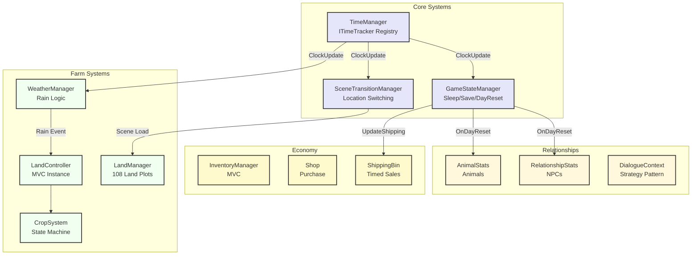
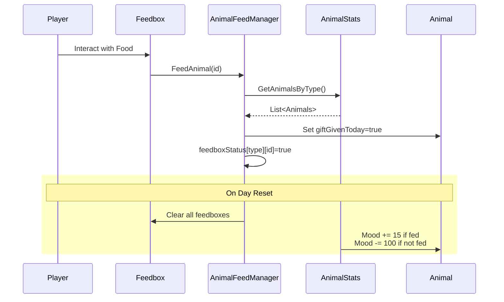

# Farming RPG | Unity | C#

A relationship-driven farming simulator featuring crop growth systems, NPC interactions, and persistent world state. Built with MVC architecture and event-driven communication to manage complex interdependent systems across multiple scenes.

**Tech Stack:** Unity 3D | C# | ScriptableObjects | State Pattern | Strategy Pattern | Observer Pattern

---

## Development Approach

I structured the game around MVC with a central manager pattern - LandManager coordinates between individual land plots, CropSystem handles growth states, and TimeManager broadcasts updates to all registered listeners. When a player waters farmland, the call flows LandView → LandController → LandModel → LandManager, which batches all changes before saving. This separation meant I could test crop growth independently from rendering.

ScriptableObjects store all static data (crop growth rates, NPC dialogue trees, item stats). The TimeManager implements `ITimeTracker` interface - systems like WeatherManager, LandController, and GameStateManager register themselves and receive `ClockUpdate()` callbacks every in-game minute. This eliminated tight coupling between time-dependent systems.



---

## Key Technical Systems

* ### State Pattern for Crop Lifecycle
    - Crops transition through four states (Seed → Seedling → Harvestable → Wilted) using a state machine. Each state implements `ICropState` with `EnterState()`, `Grow()`, and `Wither()` methods. The challenge was handling regrowable crops - when harvested, they need to reset growth timers without destroying the GameObject.
    - I solved this by having HarvestableState detach the harvestable GameObject from the crop's transform when it's not regrowable, then calling `context.RemoveCrop()` which destroys the entire crop. For regrowables, the crop stays parented and calls `context.Regrow()`, which sets `growth` to `maxGrowth - regrowTimeInMinutes` and transitions back to Seedling state.

    ```mermaid
    stateDiagram-v2
        [*] --> Seed: Plant()
        
        Seed --> Seedling: growth >= maxGrowth/2
        
        Seedling --> Harvestable: growth >= maxGrowth
        Seedling --> Wilted: health <= 0
        
        Harvestable --> Seedling: Regrow()<br/>(regrowable crops)
        Harvestable --> [*]: RemoveCrop()<br/>(normal crops)
        
        Wilted --> [*]: Remove with Shovel
        
        note right of Harvestable
            Regrowable crops:
            growth = maxGrowth - regrowTime
            State persists
        end note
    ```

    - The CropContext holds all shared data (`growth`, `health`, `maxGrowth`) and mediates state transitions. This kept state classes stateless - they operate on context data rather than storing their own. When loading saves, I instantiate the correct state using `CropStateFactory.CreateState(stateType)` and directly set growth/health values before calling `EnterState()`.

### Strategy Pattern for NPC Dialogue

NPCs have two dialogue flows: default conversation and gift-giving. Instead of branching logic in InteractableCharacter, I used the Strategy pattern with `IDialogueStrategy`. The DialogueContext switches between `DefaultDialogueStrategy` and `GiftDialogueStrategy` based on whether the player is holding an item.

GiftDialogueStrategy is complex - it checks `FirstMeeting()` to reject gifts, evaluates `GetReactionToGift()` against the character's likes/dislikes lists, and multiplies friendship points by 8x if `IsBirthday()` returns true. I chained actions using `System.Action` delegates to stack the gift consumption and character rotation reset callbacks.

### Animal Husbandry with Mood System

Animals have both friendship and mood values. Mood (0-255) decays by 100 daily if not fed, while friendship changes based on interaction. The challenge was tracking which animals were fed when multiple animals of the same type exist.

I created AnimalFeedManager with a `Dictionary<AnimalData, bool[]>` where each feedbox has an ID. When the player feeds a box, it finds the first eligible animal of that type where `giftGivenToday == false` and sets it true. On day reset, all feedboxes clear and mood/friendship update based on whether flags were set. ChickenBehaviour checks these conditions in `LayEgg()` - eggs only spawn if `age >= daysToMature` AND `Mood > 30` AND `!givenProduceToday`.



### Weather System with Time Integration

The WeatherManager subscribes to TimeManager and runs two systems: scheduled rain (14:00-16:00 with seasonal probability) and random rain events. The problem was making rain affect crops even when the player wasn't on the farm scene.

I solved this by having WeatherManager set a boolean `isRaining` flag that GameStateManager checks during `UpdateFarmState()`. If raining, it directly modifies the saved `LandSaveState` structs to switch from Farmland to Watered status:

```csharp
if (WeatherManager.Instance.IsCurrentlyRaining()) {
    if (land.landStatus == LandModel.LandStatus.Farmland)
        land.landStatus = LandModel.LandStatus.Watered;
}
```

The seasonal probabilities (Spring: 100%, Summer: 40%, Fall: 80%, Winter: 30%) affect both scheduled and random rain. For random events, I check every 60 in-game minutes and roll against `seasonalChance * 0.1f` to avoid constant rain.

### Economy: Shop and Time-Delayed Shipping

The Shop uses a simple purchase flow, but ShippingBin needed delayed execution. Players place items throughout the day, but sales only process at 18:00. I used a static `List<ItemSlotData>` that accumulates items across scenes.

`GameStateManager.ClockUpdate()` checks if `timestamp.hour == 18 && timestamp.minute == 0`, then calls `ShippingBin.ShipItems()` which tallies item values, adds money to PlayerModel, and clears the list. The challenge was preventing duplicate sales if the time check ran multiple times - I solved this by only checking on the exact minute (`minute == 0`), ensuring it fires once per hour transition.

### Calendar System with Birthday Tracking

The calendar renders 30 days per season with CalendarEntry components. Each entry calculates its color based on `DayOfTheWeek` and whether it matches today's date. The complex part was birthday tracking - I needed to search all CharacterScriptableObjects and display their portrait on matching dates.

`CalendarUIListing.GetCharacterWithBirthday()` iterates through `allCharacters` and compares `timestamp.day` and `timestamp.season` to each character's birthday timestamp. If found, it passes the portrait sprite to `CalendarEntry.Display()`. The calendar supports navigation between seasons by constructing new `GameTimestamp` objects with incremented season values and year rollover logic.

### Save System with Scene Persistence

The save system needed to handle data that persists even when scenes unload. I used static variables in manager classes (`LandManager.farmData`, `AnimalStats.animalRelationships`) that survive scene transitions via `DontDestroyOnLoad`.

The tricky part was crops growing while the player is in other locations. When `ClockUpdate()` fires and the player isn't on the farm, GameStateManager directly modifies the saved `LandSaveState` and `CropSaveState` structs. Structs are value types, so I had to reassign them back to the lists after modification. When the player returns to the farm, `LandManager.ImportCropData()` spawns CropBehaviour instances and calls `LoadCrop()` with the saved growth/health values.

---

## Technical Challenges

- **Event-Driven UI Updates:** Initially, changing money triggered a full UI re-render. I added `MoneyChanged` event to PlayerModel that only updates the money text. Similarly, LandModel fires `OnLandStatusChanged` which LandView subscribes to for material swaps.

- **Cross-Scene Animal Spawning:** Incubators hatch eggs after 3 in-game days. If hatching occurs while the player is in another scene, IncubationManager stores the incubator ID and spawns the chicken on the next scene load. I used `IncubationManager.eggsIncubating` (a static list) that persists across scenes, checking `timeToIncubate` each clock tick and removing entries when <= 0.

- **Time-Based Withering:** Crops needed to wither if not watered within 24 hours. I stored `GameTimestamp lastWatered` in LandModel and used `GameTimestamp.CompareTimestamps()` to calculate elapsed hours. If > 24 hours and not raining, land switches from Watered to Farmland and crops call `Wither()`.

---

## What I Learned

Using interfaces (`ITimeTracker`, `IDialogueStrategy`, `ICropState`) made systems testable in isolation - I could mock TimeManager callbacks when testing crop growth. The Strategy pattern eliminated branching in NPC interactions, making it trivial to add new dialogue types like trading or quests. Managing scene persistence with static variables was fragile - for production I'd use a singleton SaveManager with serialized data instead of relying on class statics. The animal mood/friendship dual system taught me to separate short-term state (mood) from long-term progression (friendship) for better game balance.

---

## Play Link
- https://sayannandi.itch.io/blossom-valley

---

[](https://youtu.be/AS5MBmQLmX4)
### [Watch the Gameplay Video here](https://youtu.be/AS5MBmQLmX4)


